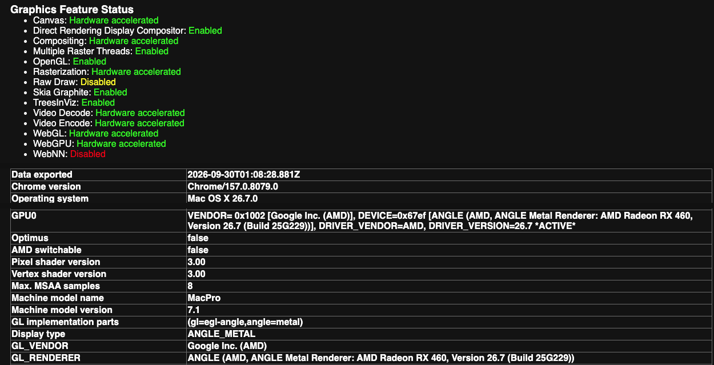

# Maclator

**Run arm64 macOS apps on an Intel Mac.** Maclator is a "reverse Rosetta": it loads an arm64 Mach-O
together with the real arm64 macOS userland (dyld and the arm64e dyld shared cache, taken from an Apple
Silicon macOS image that *you* download) and executes the arm64 code with an interpreter plus an x86-64
JIT. System calls and Mach traps go to the Intel host kernel where the semantics match and are emulated
where they don't. Metal calls can be bridged to the Intel Mac's real GPU.

The motivation: Apple dropped Intel Macs, and apps built for newer macOS versions will eventually be
arm64-only. This project explores how far you can get anyway.

> **Status: experimental research project.** Things that run today are listed below; many apps will not.
> Expect rough edges. See [docs/DEVELOPMENT.md](docs/DEVELOPMENT.md) for what is missing.

## What runs (verified on an Intel Core i5-4440, macOS 26.7)

| Program | Status |
|---|---|
| `fastfetch`, `neatvi` (arm64 CLI tools) | works |
| a small AppKit calculator (`tests/guest/calc`) | works |
| VS Code 1.139 arm64 (Electron) | works; typing latency ~40 ms |
| Chromium 157 arm64 snapshot | works, including **GPU acceleration** (ANGLE/Metal → host AMD GPU, 60 fps canvas) |
| balenaEtcher 2.1.7 arm64 (Electron) | starts (device access untested) |

Not done: audio, most IOKit hardware, sandboxed apps, Swift-heavy Apple apps, `CAMetalLayer`-based apps.



*The arm64 Chromium 157 snapshot running under Maclator on an Intel Mac (`chrome://gpu`): compositing, rasterization, WebGL and WebGPU are hardware accelerated on the machine's AMD Radeon RX 460, through the ANGLE/Metal bridge.*

## Quick start

You need an Intel Mac on macOS 26 (Tahoe) with Xcode Command Line Tools and a Rust toolchain, about 10 GB of
free disk, and an internet connection for the one-time download of the arm64 dyld shared cache.

```bash
git clone https://github.com/linuxkid473/maclator && cd maclator
scripts/install.sh            # builds maclator + the GPU bridge, installs to ~/bin
scripts/fetch-sysroot.sh      # downloads the arm64e dyld shared cache (≈5.5 GB) into ~/maclator-sysroot
maclator ./some-arm64-binary  # that's it; the sysroot is found automatically
```

Details, alternatives and requirements: **[docs/SETUP.md](docs/SETUP.md)**.
Running Chromium, VS Code and other apps: **[docs/USAGE.md](docs/USAGE.md)**.

## Documentation

| | |
|---|---|
| [docs/SETUP.md](docs/SETUP.md) | requirements, building, getting the arm64 userland, installing the GPU bridge |
| [docs/USAGE.md](docs/USAGE.md) | command-line flags, launching Chromium / VS Code / Etcher, tips |
| [docs/TROUBLESHOOTING.md](docs/TROUBLESHOOTING.md) | symptoms and fixes |
| [docs/ARCHITECTURE.md](docs/ARCHITECTURE.md) | loader, dyld/shared cache handling, syscall emulation, JIT, AOT cache |
| [docs/GPU.md](docs/GPU.md) | the Metal → host GPU bridge: design, protocol, profiling, pitfalls |
| [docs/PERFORMANCE.md](docs/PERFORMANCE.md) | measurements, JIT optimisations, Chromium configuration |
| [docs/DEBUGGING.md](docs/DEBUGGING.md) | flags, signals, JIT differential self-tests |
| [docs/DEVELOPMENT.md](docs/DEVELOPMENT.md) | open problems, bug list, history |
| [bench/](bench/README.md) | benchmark and test drivers |

## Legal

Maclator contains **no Apple binaries**. The arm64 userland is downloaded by you from Apple's own update
servers (via [`ipsw`](https://github.com/blacktop/ipsw)) and stays on your machine. You are responsible for
complying with Apple's software license terms for whatever you download and run, and with the licenses of the
apps you run. `ref/` holds excerpts of Apple open-source code (APSL 2.0 / Apache 2.0) used as reference, with
their license headers intact. See [NOTICE](NOTICE). Maclator does not attempt to run, or to circumvent
protection of, FairPlay/DRM-encrypted binaries.

MIT licensed, see [LICENSE](LICENSE).
